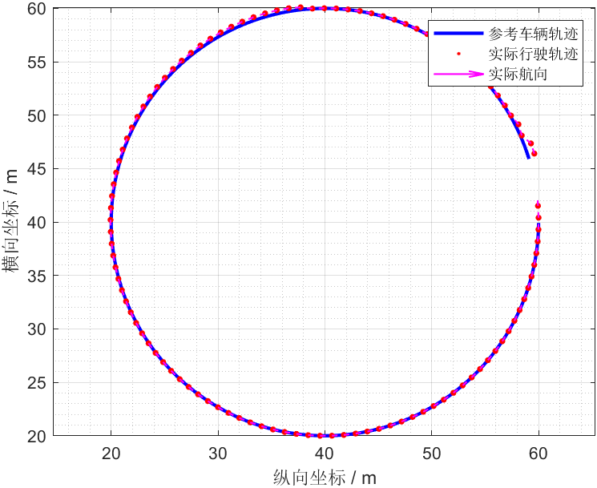
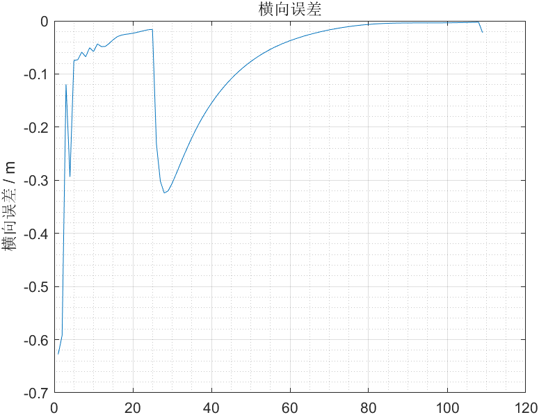

# 基于Matlab使用LQR实现车辆轨迹跟踪

1. 建立关于控制的误差微分方程  
   $\dot{e_{rr}}=Ae_{rr}+Bu$  
2. 离散化  
   $e_{rr(k+1)}=\bar{A}e_{rr(k)}+\bar{B}u_{(k)}$  
3. 迭代求解Raccati方程  
   $P_{k+1} = Q+\bar{A}^TP_{k}\bar{A}-\bar{A}^TP_{k}\bar{B}(R+\bar{B}^TP_{k}\bar{B})^{-1}\bar{B}^TP_{k}\bar{A}$
4. LQR求得的最优控制律u是关于状态量的线性函数  
   $K=(R+\bar{B}^TP\bar{B})^{-1}\bar{B}^TP\bar{A}$  
   $u_k=-Ke_{rr(k)}$

在参考资料1的基础上修正部分错误，优化代码，演示算法。  
  
  

## 参考

1. [B站小黎](https://www.bilibili.com/video/BV1GN411X74z/?spm_id_from=333.999.0.0&vd_source=be5bd51fafff7d21180e251563899e5e)
